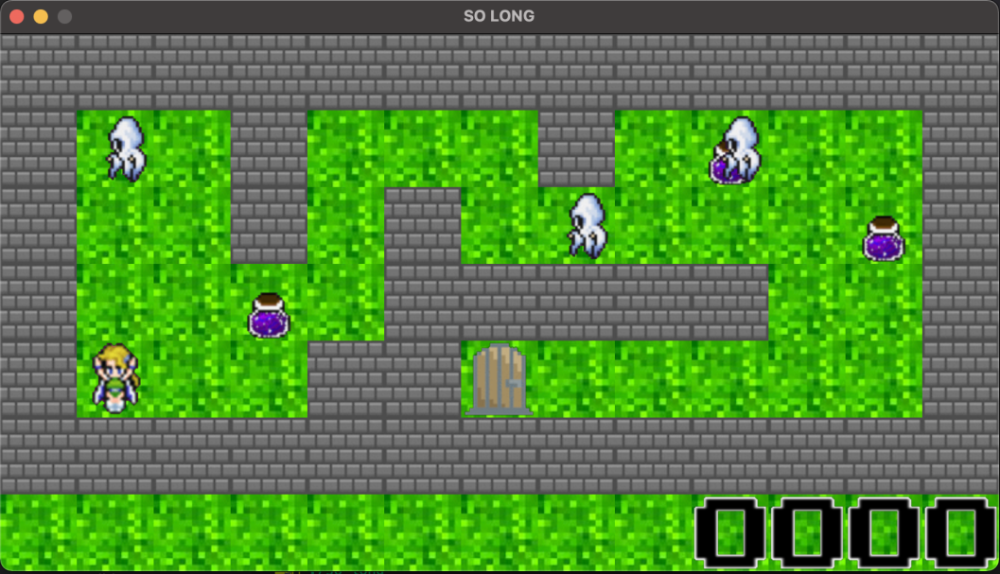
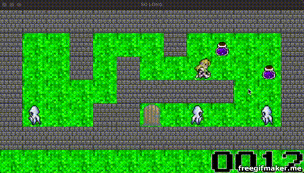

# 42Bangkok so_long

Creating a 2D graphic game with MinilibX.
<!-- <div align="center">
    
</div> -->

<hr>

## Installation

Clone this repository to your computer:
```sh
git clone https://github.com/viruskizz/42bangkok-so_long.git
```

First compile and install library
```sh
make
```

## How to play
### Rule
Control your character to collect all items in the map. Collect all items in map before exit. Avoid the enemy nonetheless you would died.

### Command

Run game by execute `so_long` file.
```bash
./so_long
```

Run game with specific map file by add file name as argument
```
./so_long "simple.ber"
```

Recompile a game, After edit `game.h` setting
```bash
make restart
```

### Key control
You can control the main character with specific key below. Sometime you need to hide yourself from an enemy. You need press `spacebar` to collect an item from ground.

|Key|Description|
|--|--|
| `A` or ⬅️ | Walk Left|
| `W` or ⬆️ | Walk Up|
| `S` or ⬇️ | Walk Down|
| `D` or ➡️ | Walk Right|
| `CTRL` or `Control`| Hide|
| `Spacebar` | Sit or Get an item |
| `Enter` | Action to Exit Door |



[Watch full demo]

## Customize
### Game Settings
You also can customize this game as you like. Just edit `includes/game.h` file. the game setting has describe below

|Name|Type|description|
|--|--|--|
| FRAME_RATE | *number | time of rendering frame per second |
| BUF_SIZE   | *number | buffer size of reader |
| SCORE_LEN  | *number | length of score |
| TILE_SIZE  | number  | size of game `64` or `32` bit |
| ENEMY      | number  | Maximun enemy in map |
| SPAWN_RATE | number  | spawn enemy rate per second |
| MAP_FILE   | string  | map file name in `maps` directory |
_*NOT RECOMMENDED TO CHANGE THIS VALUE_

**The default setting as below**
```cpp
# define GAME_H
# define FRAME_RATE     60
# define BUF_SIZE       4098
# define SCORE_LEN      4
# define TILE_SIZE      64
# define ENEMY          0
# define SPAWN_RATE     3
# define MAP_FILE       "simple_mon.ber"
```

### Map File
You can create your own map file as you like but need to follow these rules.
- map is covered with walls
- map is contained with 1 item, 1 player and 1 exit door.
- The map must be rectangular
- map file name need end with `.ber`
- place map file in `maps` directory

The character is defined in file follow like these
| Character |Description|
|--|--|
| `0` | Free space |
| `1` | Wall |
| `P` | Player |
| `E` | Exit door |
| `C` | Collectable item |
| `M` | Monster enemy |

**Map file example**
```txt
1111111111111
10M100010CM01
10010100M00C1
100C011111001
1P0011E000001
1111111111111
```

## Resources
- [MiniLibX]
- [MiniLibX Document]
- [MiniLibX Tutorial]
- [MiniLibX Example]
- [Basic Game Example]
- [Pacman Game Example]
- [Sprite Resources]

## Thank you
- Github README inspiration: [@S-LucasSerrano]
- Sprite Images editor: [AmityKDA] and [Kassaidin]

~~ Good luck with your projects! ~~
<!-- MARKDOWN LINKS & IMAGES -->
<!-- https://www.markdownguide.org/basic-syntax/#reference-style-links -->
[Watch full demo]: https://www.youtube.com/watch?v=uNdFxDJdcTA
[MiniLibX]: https://github.com/42Paris/minilibx-linux
[MiniLibX Document]: https://harm-smits.github.io/42docs/libs/minilibx/introduction.html
[MiniLibX Tutorial]: https://aurelienbrabant.fr/blog/pixel-drawing-with-the-minilibx
[MiniLibX Example]: https://github.com/terry-yes/mlx_example
[Basic Game Example]: https://github.com/andersonhsporto/ft-so_long
[Pacman Game Example]: https://github.com/madebypixel02/so_long
[Sprite Resources]: https://www.spriters-resource.com/
[@S-LucasSerrano]: https://github.com/S-LucasSerrano/so_long
[Kassaidin]: https://github.com/Kassaidin
[AmityKDA]: https://github.com/AmityKDA